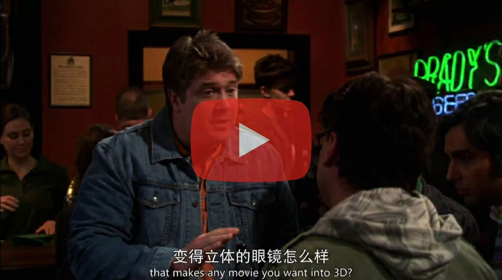

# StereoPilot: Learning Unified and Efficient Stereo Conversion via Generative Priors

<div align="center" style="margin-top: 0px; margin-bottom: 0px;">

</div>

<div align="center">

### [[Project Page]](https://hit-perfect.github.io/StereoPilot/) [arXiv] [Dataset]

_**[Guibao Shen](https://a-bigbao.github.io)<sup>1,3*†</sup>, [Yihua Du](https://hit-perfect.github.io)<sup>1*</sup>, [Wenhang Ge](https://g3956.github.io/wenhangge.github.io/)<sup>1,3*†</sup>, [Jing He](https://jingheya.github.io)<sup>1</sup>, [Chirui Chang](https://hit-perfect.github.io/StereoPilot/)<sup>3</sup>, [Donghao Zhou](https://correr-zhou.github.io/)<sup>4</sup>, [Zhen Yang](https://zhenyangcs.github.io/)<sup>1</sup>, [Luozhou Wang](https://wileewang.github.io)<sup>1</sup>, [Xin Tao](https://www.xtao.website)<sup>3</sup>, [Ying-Cong Chen](https://www.yingcong.me)<sup>1,2‡</sup>**_

<sup>1</sup>HKUST(GZ), <sup>2</sup>HKUST, <sup>3</sup>Kling Team, Kuaishou Technology, <sup>4</sup>CUHK

(*Equal contribution, †This work was conducted during the author's internship at Kling, ‡Corresponding author)

</div>

## 📖 Introduction

**TL;DR:** We propose **StereoPilot**, an efficient feed-forward architecture that leverages pretrained video diffusion transformers to directly synthesize novel views, overcoming the limitations of *Depth-Warp-Inpaint* methods without iterative denoising. With a domain switcher and cycle consistency loss, it enables robust multi-format stereo conversion. We also introduce **UniStereo**, the first large-scale unified dataset featuring both parallel and converged stereo formats.

<div align="center">

[](https://www.youtube.com/watch?v=P14q02ajKT0)

**🎬 Click the image to view our demo video**

</div>

## 🔥 Updates

- __[2025.12.16]__: Release inference code and [Project Page](https://hit-perfect.github.io/StereoPilot/).


## ⚙️ Requirements

Our inference environment:
- Python 3.12
- CUDA 12.1
- PyTorch 2.4.1
- GPU: NVIDIA A800 (only ~23GB VRAM required)

## 🛠️ Installation

**Step 1:** Clone the repository

```bash
git clone https://github.com/KlingTeam/StereoPilot.git

cd StereoPilot
```

**Step 2:** Create conda environment

```bash
conda create -n StereoPilot python=3.12

conda activate StereoPilot
```

**Step 3:** Install dependencies

```bash
pip install -r requirements.txt

pip install flash-attn==2.7.4.post1 --no-build-isolation
```

**Step 4:** Download model checkpoints

Place the following files in the `ckpt/` directory:

| File | Description |
|------|-------------|
| [`StereoPilot.safetensors`](https://huggingface.co/KlingTeam/StereoPilot) | StereoPilot model weights |
| [`Wan2.1-T2V-1.3B`](https://huggingface.co/Wan-AI/Wan2.1-T2V-1.3B) | Base Wan2.1 model directory |

Download StereoPilot.safetensor & Wan2.1-1.3B base model:

```bash
pip install "huggingface_hub[cli]"

huggingface-cli download KlingTeam/StereoPilot StereoPilot.safetensors --local-dir ./ckpt

huggingface-cli download Wan-AI/Wan2.1-T2V-1.3B --local-dir ./ckpt/Wan2.1-T2V-1.3B
```

## 🚀 Inference 

### Input Requirements

For each input video, you need:
1. **Video file** (`.mp4`): Monocular video, 81 frames, 832×480 resolution, 16fps
2. **Prompt file** (`.txt`): Text description of the video content (same name as video)

Example (you can try the cases in the `sample/` folder):
```
sample/
├── my_video.mp4
└── my_video.txt   
```

### Running Inference

**Basic usage:**

```bash
# Edit toml/infer.toml to customize model paths. If you followed the above steps, there is no need to change
python sample.py \
  --config toml/infer.toml \
  --input /path/to/input_video.mp4 \
  --output_folder /path/to/output \
  --device cuda:0
```

**Using the example script:**

```bash
bash sample.sh
```

### Generate Stereo Visualization

After inference, you can generate Side-by-Side (SBS) and Red-Cyan anaglyph stereo videos for visualization:

```bash
python utils/stereo_video.py \
  --left /path/to/left_eye.mp4 \
  --right /path/to/right_eye.mp4 \
```

**Output files:**
| Output | Description | Viewing Device |
|--------|-------------|----------------|
| `{name}_sbs.mp4` | Side-by-Side stereo video | VR Headset  |
| `{name}_anaglyph.mp4` | Red-Cyan anaglyph stereo video | 3D Glasses  |

## 📊 Dataset

We introduce **UniStereo**, the first large-scale unified stereo video dataset featuring both parallel and converged stereo formats.

<div align="center">

</div>

UniStereo consists of two parts:
- **3DMovie** - Converged stereo format from 3D movies
- **Stereo4D** - Parallel stereo format *(coming soon)*

For detailed data processing instructions, please refer to [StereoPilot_Dataprocess](./StereoPilot_Dataprocess/).

## 📄 License

This project is licensed under the MIT License - see the [LICENSE](LICENSE) file for details.

## 🙏 Acknowledgments

- [Wan2.1](https://github.com/Wan-Video/Wan2.1) - Base video generation model
- [Diffusion Pipe](https://github.com/tdrussell/diffusion-pipe) - Training code base

## 🌟 Citation

If you find our work helpful, please consider citing:

```bibtex
@article{shen2025stereopilot,
  title={StereoPilot: Learning Unified and Efficient Stereo Conversion via Generative Priors},
  author={Shen, Guibao and Du, Yihua and Ge, Wenhang and He, Jing and Chang, Chirui and Zhou, Donghao and Yang, Zhen and Wang, Luozhou and Tao, Xin and Chen, Ying-Cong},
  journal={arXiv preprint},
  year={2025}
}
```
